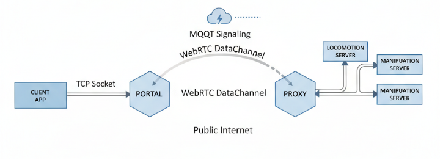

# 🏗️ 架构设计

## 🎯 1. 动机：从远程控制到 Robot as a Service

### ⚠️ 现有通用方案的挑战

A. **📡 中心化流式服务** (WebSocket/MQTT)：通过流式协议中转指令是 IoT 领域的常见做法，但在复杂的机器人控制场景

- **🔗 架构耦合**：业务逻辑与通信协议深度绑定，需开发维护复杂的私有通信协议。
- **💰 资源负担**：需要长期维护高可用的公网中转服务

B. **🔀 通用反向代理与隧道** (Frp / Cloudflare Tunnel / VPN)

- **🎯 设计初衷差异**：上述方案通常是为了让长期在线的内网服务暴露于公网，而机器人的常态是"频繁开关机/网络切换"
- **⚙️ 资源与运维压力**：配置复杂，需要为每个终端维护公网映射记录或依赖中心化带宽中转

## 🏗️ 2. 架构：基于 WebRTC 的透明隧道

本项目实现了一个跨平台的中间件，利用 WebRTC DataChannel 构建一个能够穿透 NAT 的 **TCP 透明传输层**。

### 🔧 核心机制与组件

- **🖥️ Portal (用户/控制侧)**： 发起 WebRTC 连接，监听本地端口，等待 TCP 请求并桥接 DataChannel。
- **🤖 Proxy (机器人/设备侧)**：等待 WebRTC 连接，等待 DataChannel 并桥接 TCP 连接。

### 📡 MQTT 信令通道

采用 **MQTT** 作为信令通道，解耦"连接握手"与"权限管理"

- **🤝 连接握手**
  1.  **📥 接受方**：Proxy 订阅 callee 信令话题，等待 offer，并发布 answer 到 caller 信令话题；上下线时发布 callee 状态话题；
  2.  **📤 发起方**：Portal 通过 callee 状态话题等待上线； 发布 offer 到 callee 信令话题，并从 caller 信令话题等待 answer；
- **🔐 权限管理** EMQX + Authing
  - 鉴权操作全部发生在 mqtt broker
  - 将复杂的**机器人控制权限**抽象为**标准的 MQTT Topic 读写权限**

### 🦀 技术选型：为什么选择 Rust？

- **⚡ 统一的异步生态**：基于 `Tokio` 无缝集成 `rumqttc` (MQTT)、`webrtc-rs` 和 `tonic` (gRPC)，避免上下文切换开销与复杂的架构设计。
- **🛡️ 内存与线程安全**：所有权机制在编译期消除了并发数据竞争，这对于同时处理信令、WebRTC 状态机和 TCP 连接的复杂异步系统至关重要。
- **🚀 高性能与跨平台**：Rust 提供了接近 C/C++ 的性能；支持 Android、Linux (ARM/x86) 等多种架构。

## ✨ 3. 核心优势

### 🔌 协议无关的透明传输

- **🌐 协议无关**：支持所有基于 TCP 的应用层协议。
- **⚡ 高性能转发**：Rust 零成本抽象设计，极低转发开销，充分利用 P2P 直连。

### 🚀 极简部署与一致性体验

- **💻 纯软件方案**：仅需维护 MQTT Broker 和 TURN/STUN 服务，端侧仅需一对可执行文件
- **⚙️ 配置简单**：通过唯一 ID 标识和连接，无需复杂 IP 路由
- **✨ 体验一致**：不侵入业务逻辑，公网和局域网使用完全相同的接口代码

## 🔮 4. 未来展望

- **👥 集群控制**：单 Portal 连接多个 Proxy，实现请求广播（如机器人编队控制）
- **♻️ 连接复用**：DataChannel 和 Socket 复用机制，减少握手开销
- **🔒 HTTPS 支持**
- **🔐 基于 EMQX + Authing 统一鉴权体系**
