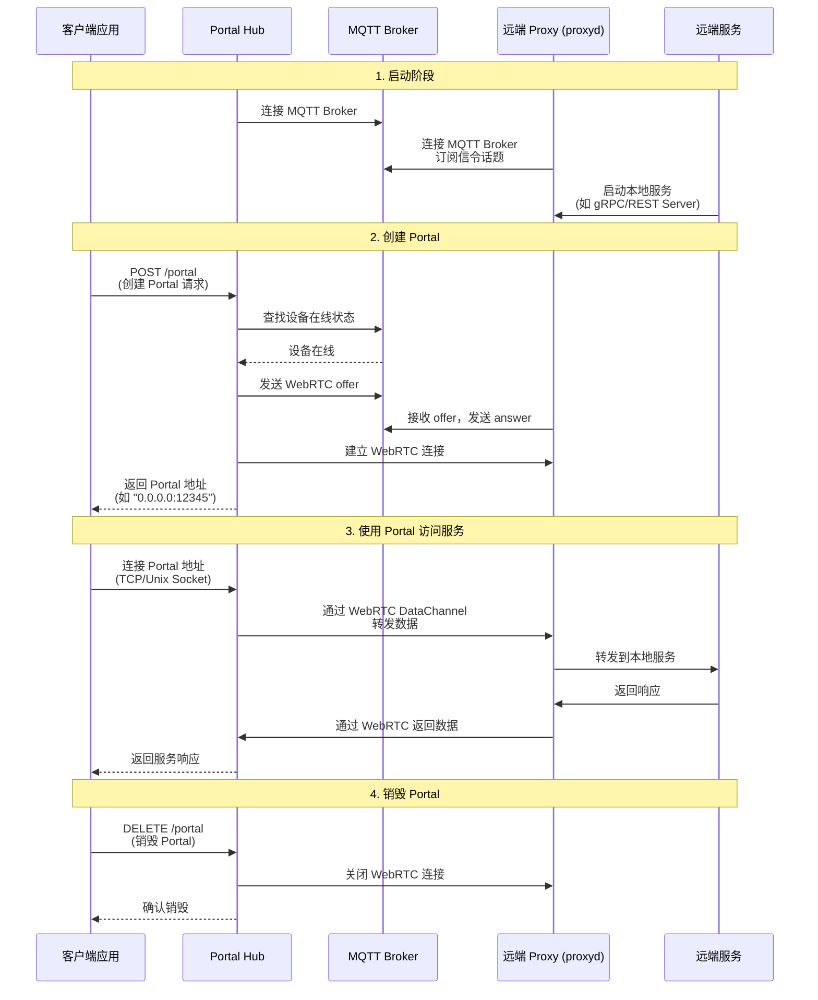

# 🔌 Portal Hub API

Portal Hub 提供了统一的 API 服务，用于动态创建和管理 WebRTC Portal。与 `portald` 不同，Portal Hub 支持多用户、多服务的集中管理。

## 📋 概述

Portal Hub 提供两种接口：

- **🔌 gRPC API** (`portal_hub_grpc`)：提供 gRPC 接口供管理 portal
- **🌐 REST API** (`portal_hub_rest`)：提供 REST 接口供管理 portal



## 📖 命令行参数详解

### 🔌 portal_hub_grpc

`portal_hub_grpc` 运行在控制端，提供 gRPC 服务用于创建和管理 Portal。

> 接口定义见 `crates/grpc/proto/lrc_user_rpc.proto`

```bash
$ ./portal_hub_grpc -h
Usage: portal_hub_grpc [OPTIONS]

Options:
  -u, --user-id <USER_ID>
          默认用户 ID，当请求中未提供 user_id 时使用 [默认: ]
  -l, --listen <LISTEN>
          Portal hub 的 gRPC 服务器监听地址 [默认: [::1]:50051]
  -m, --mqtt-broker <MQTT_BROKER>
          MQTT Broker 地址 (mqtt://host:port) [默认: mqtt://localhost:1883]
      --mqtt-username <MQTT_USERNAME>
          MQTT 用户名 [可选]
      --mqtt-password <MQTT_PASSWORD>
          MQTT 密码 [可选]
      --peer-stun <PEER_STUN>
          STUN 服务器地址 (例如: stun:stun.l.google.com:19302)，可指定多个 [默认: stun:stun.l.google.com:19302]
      --peer-turn <PEER_TURN>
          TURN 服务器地址 (例如: turn:user:pass@host:port)，可指定多个
      --online-timeout <ONLINE_TIMEOUT>
          等待远程端上线超时时间 (秒) [默认: 5]
      --connect-timeout <CONNECT_TIMEOUT>
          WebRTC 连接超时时间 (秒) [默认: 5]
  -h, --help
          显示帮助信息
```

### 🌐 portal_hub_rest

`portal_hub_rest` 运行在控制端，提供 HTTP REST API 用于创建和管理 Portal。

```bash
$ ./portal_hub_rest -h
Usage: portal_hub_rest [OPTIONS]

Options:
  -u, --user-id <USER_ID>
          默认用户 ID，当请求中未提供 user_id 时使用 [默认: ]
  -l, --listen <LISTEN>
          Portal hub 的 HTTP 服务器监听地址 [默认: 127.0.0.1:3000]
  -m, --mqtt-broker <MQTT_BROKER>
          MQTT Broker 地址 (mqtt://host:port) [默认: mqtt://localhost:1883]
      --mqtt-username <MQTT_USERNAME>
          MQTT 用户名 [可选]
      --mqtt-password <MQTT_PASSWORD>
          MQTT 密码 [可选]
      --peer-stun <PEER_STUN>
          STUN 服务器地址 (例如: stun:stun.l.google.com:19302)，可指定多个 [默认: stun:stun.l.google.com:19302]
      --peer-turn <PEER_TURN>
          TURN 服务器地址 (例如: turn:user:pass@host:port)，可指定多个
      --online-timeout <ONLINE_TIMEOUT>
          等待远程端上线超时时间 (秒) [默认: 5]
      --connect-timeout <CONNECT_TIMEOUT>
          WebRTC 连接超时时间 (秒) [默认: 5]
  -h, --help
          显示帮助信息
```

## 📚 API 使用说明

### ➕ 创建 Portal

**端点**: `POST /portal` | `lrc.user.rpc.PortalLauncher/CreatePortal`

**请求体**:

> grpc 请求体 `Config` 与 Json 请求体字段一致

```json
{
  "user_id": "user_1", // 可选，用户 ID
  "robot_id": "robot_1", // 必须，机器人/设备 ID
  "service_name": "tcp_service", // 必须，服务名称
  "portal_type": "inet", // 可选，"inet" 或 "unix"，默认 "inet"
  "inet_port": "12345", // 可选，仅当 portal_type="inet" 时有效
  "unix_file": "/tmp/sock" // 可选，仅当 portal_type="unix" 时有效
}
```

**响应体**:

> grpc 响应体 `SockAddr` 与 Json 请求体字段一致

```json
{
  "uri": "0.0.0.0:12345" // Portal 地址 URI
  // type=INET: "0.0.0.0:12345"
  // type=UNIX: "unix:///tmp/rpc_gps.sock"
}
```

### ➖ 销毁 Portal

**端点**: `DELETE /portal` | `lrc.user.rpc.PortalLauncher/DestroyPortal`

**请求体**: 同 `CreatePortal` 的 `Config`（至少需要 `robot_id` 和 `service_name`）

**响应体**: 空消息

## 🔗 代码示例

完整的代码示例请参考 `examples/` 目录：

- **REST API 示例**：

  - [`examples/rest_server.py`]({{ repo_url }}/examples/rest_server.py) - REST 服务端示例
  - [`examples/rest_client_pipe.py`]({{ repo_url }}/examples/rest_client_pipe.py) - 通过 Portal Hub REST API 创建 Portal 并访问服务的客户端示例

- **gRPC API 示例**：
  - [`examples/grpc_server.py`]({{ repo_url }}/examples/grpc_server.py) - gRPC 服务端示例
  - [`examples/grpc_client_pipe.py`]({{ repo_url }}/examples/grpc_client_pipe.py) - 通过 Portal Hub gRPC API 创建 Portal 并访问服务的客户端示例

## 🎯 使用场景

1. **☁️ 云平台设备管理** - 通过统一的 API 管理多个设备的 Portal
2. **🔧 微服务架构** - 服务间通过 Portal Hub 动态建立连接
3. **👥 多租户系统** - 不同用户通过 `user_id` 隔离 Portal 资源
4. **🧪 自动化测试** - 通过 API 动态创建和销毁测试环境

## ⚠️ 注意事项

1. **用户 ID 管理**: 如果请求中未提供 `user_id`，必须通过命令行参数 `-u/--user-id` 设置默认值
2. **远程 ID 构建**: Portal Hub 会自动将 `robot_id` 和 `service_name` 组合为远程 ID，格式为 `{robot_id}-{service_name}`
3. **端口分配**: 创建 INET 类型 Portal 时，如果不指定 `inet_port`，系统会自动分配随机端口
4. **连接超时**: 确保设备端（proxyd）已启动并在线，否则创建 Portal 会超时失败
